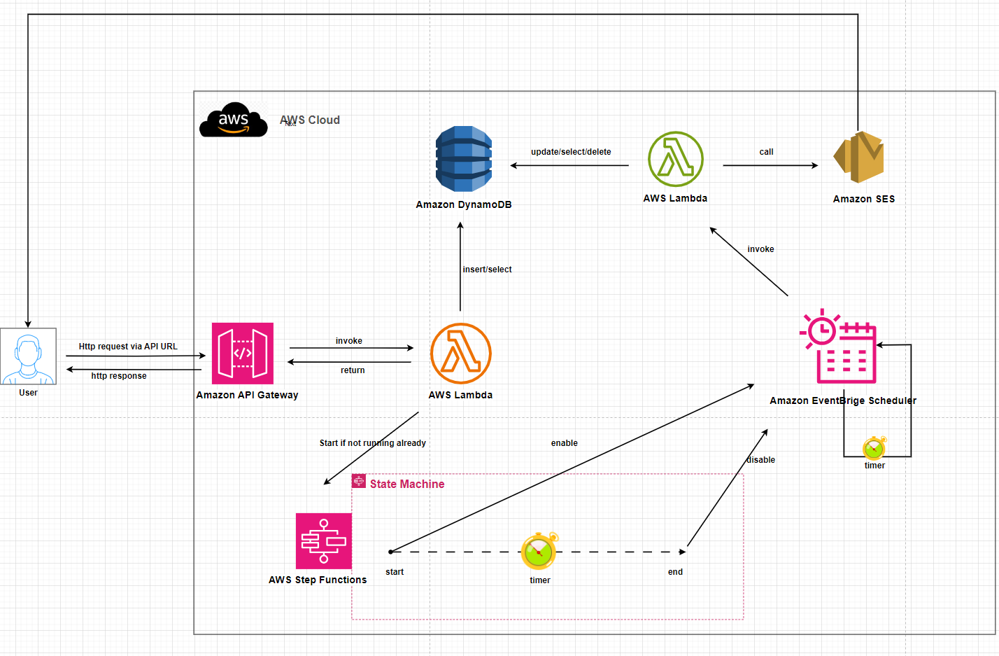

# Topic 7 - RESTful application(API) using Database(DynamoDB+SES+ApiGateway+StepFunctions+Eventbridge+Lambda)
## Yuanchao Hands-on Project

## This readme is more readable [here](https://github.com/lyc-handson-aws/handson-topic7)

## **Overview**

**Project's main features**
:point_right: A RESTful application "Pets storage shop"

:point_right: people can store their pet in this shop, by providing foods for their pets

 :point_right: when people give their pet to shop, they need to indicate:

- pet's name
- food amount
- owner's name
- owner's email

:point_right: the shop's capacity is 4, when shop has already 4 pets stored, the storing is not longer possible, unless a empty place is freed

:point_right: by nature, the pet will not feel comfortable in a new environment, they need times to adapt.

:point_right: by time, each pet will eat the food provided by their owner, and the food is consumed very quickly at the beginning.

:point_right: if there is no enough food for a pet, unfortunately, the pet will die due to the lack of food. when it happens, shop will notify the owner by email. so a new place is made in shop.

:point_right: once a pet gets used to the environment, it can stay forever healthily in shop

:point_right: call this API via this URL: you can do it either via postman or browser 

## **Architecture**
the diagram below illustrates the architecture(principle) of this project:

## Continue Deployment
CloudFormation stack's deployment: see GitHub workflows https://github.com/lyc-handson-aws/handson-topic7/blob/main/.github/workflows/action-cf.yaml

## **CloudFormation Stack Quick-create Link**
Click here to quickly create a same project with the same AWS resources:  [here](https://eu-west-3.console.aws.amazon.com/cloudformation/home?region=eu-west-3#/stacks/create/review?templateURL=https://s3bucket-handson-topic1.s3.eu-west-3.amazonaws.com/CF-template-handson-topic7.yaml)
**See Stack's description for complete actions to reproduce the same project**

There

> the default stack's region "Europe (Paris) eu-west-3"

## **AWS Resources**
Project's AWS resources:

:point_right: AWS::SES::EmailIdentity - define a email domain/address 

:point_right: AWS::DynamoDB::Table - define a DynamoDB table for store the data of application

 :point_right: AWS::Lambda::Function- define 2 functions. one for receiving RESTful request from Api Gateway and write in DB, one is triggered by scheduler(Event bridge) for modifying in DB and send notification(email), if condition is satisfied

:point_right:AWS::Scheduler::Schedule - A Event bridge Scheduler set to launch periodically a Lambda function

:point_right: AWS::StepFunctions::StateMachine - A workflow for controlling when the scheduler is enable/disable => some logics of applications are not activated when there is no activity after a while

:point_right: AWS::ApiGateway
- AWS::ApiGateway::RestApi - define a API type RESTful
- AWS::ApiGateway::Resource - define a API resource : path, type 
- AWS::ApiGateway::Method - define 2 methods for our API resource: Get,Post
- AWS::ApiGateway::Stage - define API's stages, one can have multiple stages. here we have only one stage: PROD
- AWS::ApiGateway::Deployment - deploy API defined
- AWS::ApiGateway::Account - configure the API account(here log), every AWS account has one API account